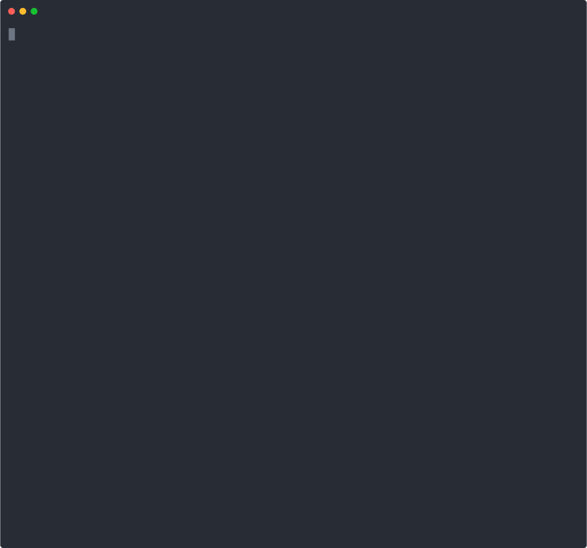

# Analemma GVM

**Prevent autonomous AI agents from calling unintended APIs.**

Drop-in governance for OpenClaw and any MCP client.

<p align="center">
  
</p>

`17MB binary` · `~5MB memory` · `~0.4ms overhead` · `no GPU / containers required`

---

## Why this exists

Prompt-injected agents skip governance tools.
Shadow Mode prevents this by rejecting any request that has no prior MCP intent declaration.

```
Agent ──→ gvm_declare_intent() ──→ GVM Proxy ──→ External API
                                      │
                              no intent? → BLOCKED
```

| Capability | Without Shadow | With Shadow `strict` |
|-----------|---------------|---------------------|
| **API misuse blocking** | Proxy enforces (always) | Proxy enforces (always) |
| **Intent forgery detection** | Agent can skip | **Required** — proxy cross-checks intent vs URL |
| **Checkpoint / rollback** | Agent can skip | Skip = blocked = failed task |

> MCP is the conversation. Proxy is the enforcement.
> Declare intent = fast path. Skip intent = blocked.

---

## Quick Start

```bash
# 1. Install proxy binary
cargo binstall gvm-proxy

# 2. Install skill (prebuilt — no npm/build step)
git clone https://github.com/skwuwu/analemma-gvm-openclaw.git \
  ~/.openclaw/skills/gvm-governance
```

Done. The MCP server **automatically launches the GVM proxy** when your agent platform starts it.
You do not need to run `gvm-proxy` manually.

Add the MCP server to your agent platform:

<details>
<summary><b>OpenClaw</b></summary>

The skill auto-loads from `~/.openclaw/skills/`. Add MCP server:
```json
// ~/.openclaw/openclaw.json
{
  "mcp": {
    "servers": {
      "gvm-governance": {
        "command": "node",
        "args": ["~/.openclaw/skills/gvm-governance/mcp-server/dist/index.js"]
      }
    }
  }
}
```
</details>

<details>
<summary><b>Claude Desktop</b></summary>

```json
{
  "mcpServers": {
    "gvm-governance": {
      "command": "node",
      "args": ["~/.openclaw/skills/gvm-governance/mcp-server/dist/index.js"]
    }
  }
}
```
</details>

<details>
<summary><b>Cursor / Windsurf</b></summary>

Same JSON format as Claude Desktop in their MCP settings.
</details>

Verify: `curl -s http://localhost:8080/gvm/health` → `{"status":"healthy"}`

---

## MCP Tools

| Tool | What it does |
|------|-------------|
| `gvm_declare_intent` | Declare operation before API call — **required in Shadow Mode** |
| `gvm_policy_check` | Dry-run: will this request be allowed? |
| `gvm_request_secret` | Confirm credential auto-injection (never set auth headers) |
| `gvm_checkpoint` | Save state before risky operations |
| `gvm_rollback` | Restore to checkpoint after a Deny |
| `gvm_audit_log` | View recent governance decisions |
| `gvm_load_rulesets` | Auto-detect installed skills → load matching rules |

---

## Preset Rulesets

10 rulesets covering top OpenClaw skills. Pattern: **read → Allow, write → Delay, delete → Deny**.

| Ruleset | Domains | Skills |
|---------|---------|--------|
| `github.toml` | api.github.com | github, gh-issues, coding-agent |
| `gmail.toml` | gmail.googleapis.com | gmail, himalaya |
| `slack.toml` | slack.com/api | slack |
| `discord.toml` | discord.com/api | discord |
| `notion.toml` | api.notion.com | notion |
| `trello.toml` | api.trello.com | trello |
| `openai.toml` | api.openai.com | openai-image-gen, openai-whisper-api |
| `gemini.toml` | googleapis.com | gemini |
| `spotify.toml` | api.spotify.com | spotify-player |
| `weather.toml` | wttr.in | weather |

Skills with no matching ruleset use Default-to-Caution (Delay + audit log).

---

## Performance

```
  gvm_declare_intent            ~0.35 ms   (stdio + policy check + intent register)
  Shadow verify                 ~0.01 ms   (in-memory lookup)
  SRR + ABAC evaluation          <0.01 ms  (compiled regex, sub-μs)
  ──────────────────────────────────────
  Total GVM overhead (Allow)    ~0.4 ms
  External API latency          50-500 ms
```

| Path | Latency | What happens |
|------|---------|-------------|
| **Allow** | ~0.4 ms | Intent verified, request forwarded |
| **Deny** | ~4.2 ms | WAL fsync (audit record durable before 403) |
| **Shadow Deny** | ~0.01 ms | No intent → instant 403, no WAL needed |

Deny is slower because the denial record must be durable before the 403 response. This is intentional — Cilium/Envoy use fire-and-forget logging; GVM blocks until fsynced.

Benchmark: [Daytona sandbox measurements](https://github.com/skwuwu/analemma-gvm-daytona/blob/master/bench/results.md) (N=50, real cloud).

---

## How it works

```
Agent (OpenClaw / Claude / Cursor)
  │
  ├─ MCP: gvm_declare_intent()     ← cooperative layer
  │
  ├─ HTTP request via proxy         ← enforcement layer
  │   ├─ Shadow verify (intent exists?)
  │   ├─ SRR: URL + method + path rules
  │   ├─ ABAC: semantic policy (if intent declared)
  │   ├─ API key injection (agent never holds keys)
  │   └─ WAL: Merkle-chained audit record
  │
  └─ External API
```

**Why two layers?**

| Approach | Cooperative? | Forced? | Forgery detection? |
|----------|-------------|---------|-------------------|
| MCP only | Yes | No — agent can skip tools | No |
| Proxy only | No | Yes — all HTTP intercepted | No — no semantic layer |
| **MCP + Proxy** | **Yes** | **Yes** | **Yes — cross-layer** |

---

## Zero Infrastructure

| | GVM Proxy | NemoClaw | Container-based |
|---|---|---|---|
| **Binary** | **17MB** | ~2GB (Python + models) | 500MB+ (Docker) |
| **Memory** | **~5MB** | 512MB-2GB | 256MB+ |
| **GPU** | No | Required | Depends |
| **Startup** | <1s | 10-30s | 5-15s |

<details>
<summary><b>OS compatibility</b></summary>

| Feature | Linux | macOS | Windows |
|---------|-------|-------|---------|
| Proxy + SRR + WAL + Merkle | Yes | Yes | Yes |
| MCP Shadow Mode | Yes | Yes | Yes |
| API key isolation | Yes | Yes | Yes |
| `--sandbox` (namespace + seccomp + eBPF) | **Yes** | No | No |
| `--contained` (Docker isolation) | Yes | Yes | Yes |

Without `--sandbox`, the proxy governs traffic that passes through it, but an agent could bypass by making direct HTTPS connections.
</details>

<details>
<summary><b>SDK vs MCP comparison</b></summary>

| Capability | SDK (`@ic`) | MCP + Proxy |
|-----------|------------|-------------|
| SRR URL matching | Automatic | Automatic |
| ABAC policy | Automatic | `declare_intent` call |
| Cross-layer forgery | Automatic (`max_strict`) | Shadow Mode required |
| API key isolation | Automatic | Automatic |
| Merkle audit | Automatic | Automatic |
| Checkpoint | `auto_checkpoint="ic2+"` | `gvm_checkpoint` manual |
| Rollback | `GVMRollbackError` auto | `gvm_rollback` manual |
| Language | Python only | Any MCP client |
| Code changes | Add `@ic()` decorators | Zero |
</details>

---

## Repository layout

```
mcp-server/           MCP server — 7 governance tools (JSON-RPC stdio)
skills/               OpenClaw skills (SKILL.md)
rulesets/             10 preset SRR rulesets + auto-detection registry
demo/                 Shadow Mode demo (curl only, no OpenClaw needed)
```

## Environment variables

| Variable | Default | Description |
|----------|---------|-------------|
| `GVM_PROXY_URL` | `http://127.0.0.1:8080` | GVM proxy base URL |
| `GVM_AGENT_ID` | `mcp-agent` | Agent identity for WAL records |
| `GVM_TENANT_ID` | — | Tenant identity (multi-tenant) |

## Core repository

Source and docs: [skwuwu/Analemma-GVM](https://github.com/skwuwu/Analemma-GVM)
