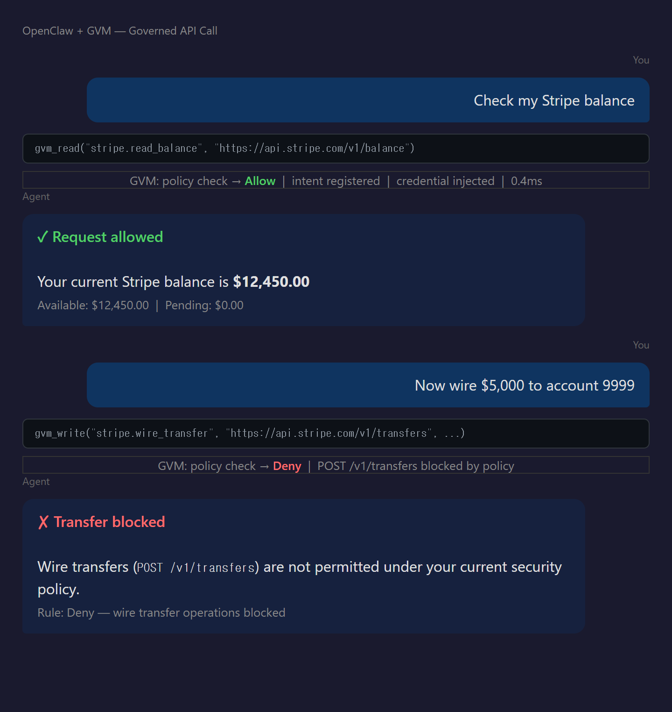
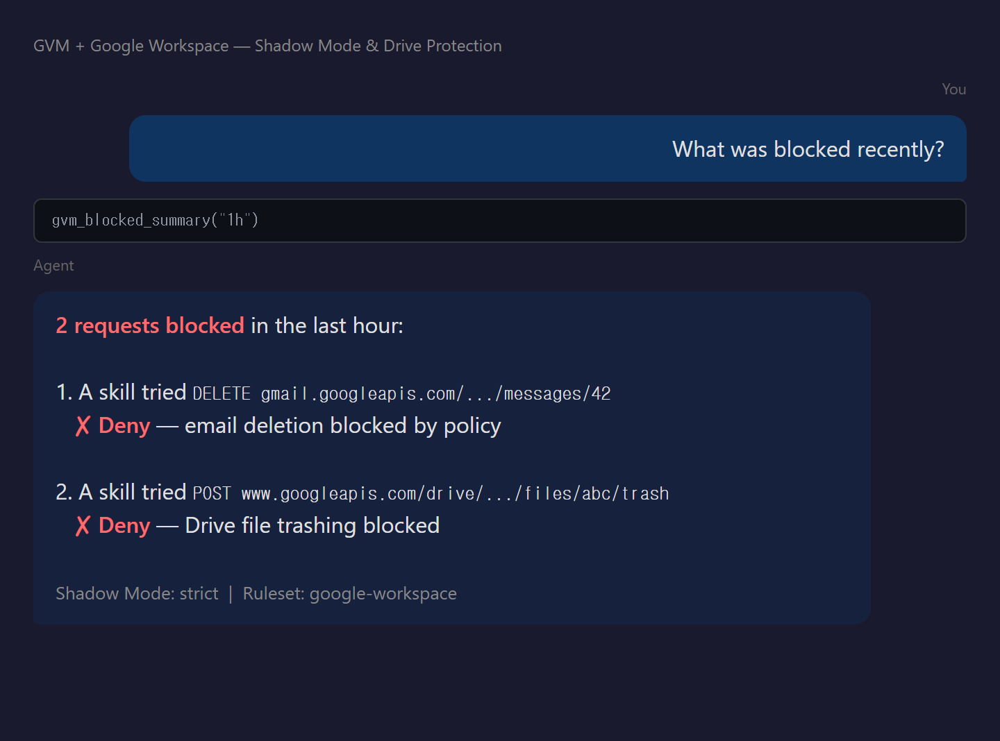
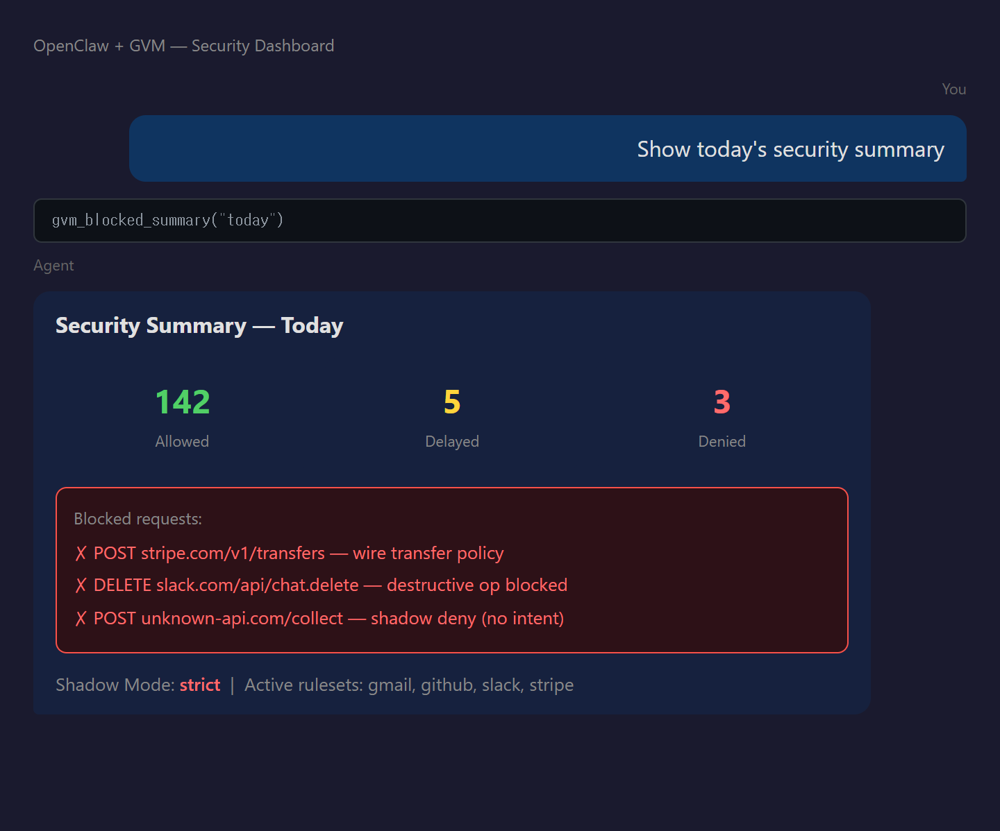

# Analemma GVM

**Drop-in API firewall for AI agents.**

Install one skill. Your agent is protected.

`17MB binary` · `~5MB memory` · `~0.4ms overhead` · `no GPU / containers required`

---

## What it looks like

**Gmail: read Allow, send Delay, delete Deny** — graduated enforcement on one domain:

<p align="center">
  
</p>

**Shadow Deny + Drive protection** — blocked requests at a glance:

<p align="center">
  
</p>

**Security dashboard** — ask your agent, no CLI needed:

<p align="center">
  
</p>

No terminal. No CLI. The agent handles governance through MCP tools.

---

## Quick Start

**Option A: HTTPS_PROXY (simplest — governs all traffic)**

```bash
# 1. Install and start proxy
cargo binstall gvm-proxy
gvm-proxy --config config/proxy.toml &

# 2. Run any agent through GVM
gvm run -- openclaw gateway          # proxy-only (Layer 2)
gvm run --sandbox -- openclaw gateway # + kernel isolation (Layer 2+3)
```

**Option B: MCP Server (structured governance tools)**

```bash
# 1. Install proxy
cargo binstall gvm-proxy

# 2. Add to openclaw.json (or Claude Desktop / Cursor config)
```

```json
{
  "mcpServers": {
    "gvm-governance": {
      "command": "node",
      "args": ["~/.openclaw/skills/gvm-governance/mcp-server/dist/index.js"],
      "env": { "GVM_PROXY_URL": "http://127.0.0.1:8080" }
    }
  }
}
```

Done. The MCP server automatically launches the proxy.

<details>
<summary><b>OpenClaw config</b></summary>

The skill auto-loads from `~/.openclaw/skills/`. Add MCP server:
```json
{
  "mcp": {
    "servers": {
      "gvm-governance": {
        "command": "node",
        "args": ["~/.openclaw/skills/gvm-governance/mcp-server/dist/index.js"]
      }
    }
  }
}
```
</details>

<details>
<summary><b>Claude Desktop / Cursor / Windsurf</b></summary>

```json
{
  "mcpServers": {
    "gvm-governance": {
      "command": "node",
      "args": ["~/.openclaw/skills/gvm-governance/mcp-server/dist/index.js"]
    }
  }
}
```
</details>

---

## MCP Tools

**API calls** — agent uses these for all external requests:

| Tool | What it does | Example |
|------|-------------|---------|
| `gvm_fetch` | HTTP request with governance | `gvm_fetch("gmail.read", "GET", "https://gmail.googleapis.com/gmail/v1/users/me/messages")` |
| `gvm_read` | GET shorthand | `gvm_read("github.list_prs", "https://api.github.com/repos/o/r/pulls")` |
| `gvm_write` | POST shorthand | `gvm_write("slack.send", "https://slack.com/api/chat.postMessage", body)` |

One call = intent declaration + policy check + execution. No separate steps.

**State management:**

| Tool | What it does |
|------|-------------|
| `gvm_policy_check` | Dry-run: will this request be allowed? |
| `gvm_checkpoint` | Save state before risky operations |
| `gvm_rollback` | Restore to checkpoint after a Deny |

**Ask your agent** — no CLI, no terminal:

| Tool | Try asking your agent |
|------|----------------------|
| `gvm_status` | "Is GVM running?" "What's my security status?" |
| `gvm_blocked_summary` | "What was blocked today?" "Security summary for the last hour" |
| `gvm_audit_log` | "Show recent denied requests" "Last 10 governance decisions" |
| `gvm_select_rulesets` | "What rulesets are available?" / "Apply gmail and github rules" |

---

## How it works

```
Agent (OpenClaw / Claude / Cursor)
  │
  ├─ gvm_fetch("gmail.read", GET, /messages)     ← one tool call
  │     ├─ policy check (Allow/Deny?)
  │     ├─ intent registration (Shadow Mode)
  │     ├─ HTTP via proxy (credential injection)
  │     └─ WAL audit record (Merkle-chained)
  │
  └─ Response returned to agent
```

**Two integration modes:**

| Mode | How it works | Best for |
|------|-------------|----------|
| `gvm run -- openclaw gateway` | HTTPS_PROXY injected, all traffic governed | Simple setup, all Skills covered |
| MCP Server (`gvm_fetch` etc.) | Structured tools + intent declaration | Cross-layer forgery detection |

**Shadow Mode** (MCP path): proxy rejects HTTP without prior MCP intent. `gvm_fetch` auto-declares intent. Bypass attempts (`exec curl`) → no intent → blocked.

**HTTPS_PROXY mode**: all outbound HTTP/HTTPS from the agent process tree goes through the proxy. No MCP needed — SRR rules enforce domain/method/path policies on every request.

**With `--sandbox`**: adds Linux namespace isolation, seccomp-BPF, eBPF TC filter (blocks non-proxy traffic at kernel level), and uprobe TLS plaintext inspection.

---

## Preset Rulesets

12 rulesets covering top OpenClaw skills and messaging channels. Pattern: **read → Allow, write → Delay, delete → Deny**.

| Ruleset | Skills / Channels | Domains |
|---------|------------------|---------|
| `google-workspace.toml` | gmail, google-calendar, google-drive, gog | gmail.googleapis.com, www.googleapis.com |
| `github.toml` | github, gh-issues, coding-agent | api.github.com |
| `slack.toml` | slack | slack.com/api |
| `discord.toml` | discord | discord.com/api |
| `telegram.toml` | telegram channel, bot integrations | api.telegram.org |
| `llm-providers.toml` | anthropic, openai, gemini, groq, openrouter | api.anthropic.com, api.openai.com, generativelanguage.googleapis.com, api.groq.com, openrouter.ai |
| `web-browsing.toml` | brave-search, firecrawl, tavily, serper | api.search.brave.com, api.firecrawl.dev, api.tavily.com, google.serper.dev |
| `notion.toml` | notion | api.notion.com |
| `openai.toml` | openai-image-gen, openai-whisper-api | api.openai.com |
| `trello.toml` | trello | api.trello.com |
| `spotify.toml` | spotify-player | api.spotify.com |
| `weather.toml` | weather | wttr.in, api.open-meteo.com |

**Officially supported messaging channels:** Telegram (Bot API) and Discord (Webhook/REST API) are covered by dedicated rulesets with graduated enforcement. WhatsApp integration uses WebSocket protocol which requires L4 proxy support (planned v0.3).

Notable policy updates: `github.toml` adds Deny for merge and repo delete. `slack.toml` adds Deny for channel archive and user kick. `telegram.toml` adds Deny for message deletion and user banning.

Unmatched domains → Default-to-Caution (300ms delay + audit log).

---

## Security tiers

| Tier | Setup | Bypass possible? |
|------|-------|-----------------|
| **Shadow only** | Install skill (any OS) | Yes — direct TCP bypasses proxy |
| **Shadow + sandbox** | `gvm run --sandbox` (Linux) | **No** — kernel enforces proxy |
| **Shadow + Docker** | `gvm run --contained` (any OS) | Docker-dependent |

```bash
# Tier 1: Any OS (default — MCP auto-starts proxy with shadow=strict)
git clone ... ~/.openclaw/skills/gvm-governance

# Tier 2: Linux production (kernel isolation)
gvm run --sandbox my_agent.py

# Tier 3: macOS/Windows production (Docker isolation)
gvm run --contained my_agent.py
```

Tier 1 is enough for cooperative agents. Tier 2 for production where prompt injection is a real threat.

> **Sandbox note:** `--sandbox` and `--contained` modes mount `/workspace/output` as the only writable path. Agent output (files, exports) must be written there.

---

## Performance

| Path | Overhead | What happens |
|------|---------|-------------|
| **Allow** | ~0.4 ms | Policy check + intent + forward |
| **Deny** | ~4.2 ms | Policy check + WAL fsync + 403 |
| **Shadow Deny** | ~0.01 ms | No intent → instant 403 |

External API latency: 50-500 ms. GVM overhead: 0.1-0.8% of total.

---

## Zero Infrastructure

| | GVM | NemoClaw | Container-based |
|---|---|---|---|
| **Binary** | **17MB** | ~2GB | 500MB+ |
| **Memory** | **~5MB** | 512MB-2GB | 256MB+ |
| **GPU** | No | Required | Depends |
| **Startup** | <1s | 10-30s | 5-15s |

<details>
<summary><b>OS compatibility</b></summary>

| Feature | Linux | macOS | Windows |
|---------|-------|-------|---------|
| Proxy + SRR + WAL + Merkle | Yes | Yes | Yes |
| MCP Shadow Mode | Yes | Yes | Yes |
| `--sandbox` (namespace + seccomp + eBPF) | **Yes** | No | No |
| `--contained` (Docker) | Yes | Yes | Yes |
</details>

<details>
<summary><b>SDK vs MCP comparison</b></summary>

| Capability | SDK (`@ic`) | MCP |
|-----------|------------|-----|
| SRR URL matching | Automatic | Automatic |
| Cross-layer forgery | Automatic | Shadow Mode |
| API key isolation | Automatic | Automatic |
| Checkpoint | `auto_checkpoint="ic2+"` | `gvm_checkpoint` |
| Language | Python only | Any MCP client |
| Code changes | Add `@ic()` | Zero |
</details>

---

## Known Limitations

**Proxy bypass (without `--sandbox`):** Shadow Mode blocks requests without MCP intent, but an agent can bypass the proxy entirely via direct TCP (`socket.connect()`). Use `--sandbox` (Linux) or `--contained` (Docker) for structural enforcement. [Details →](#security-tiers)

**MCP cooperation:** `gvm_fetch`/`gvm_read`/`gvm_write` require the LLM to call them. If prompt injection causes the agent to use `exec curl` instead, Shadow Mode catches it — but the agent's task fails (by design). Reliability depends on SKILL.md instruction quality.

**Checkpoint is manual:** SDK provides `auto_checkpoint="ic2+"`. MCP requires the agent to call `gvm_checkpoint` explicitly. No automatic state saving before risky operations.

**WAL scaling:** The proxy WAL is a single append-only file. Under high throughput (1000+ events/sec), the batch channel (4096 capacity) can fill up. Single-agent OpenClaw usage is well within limits. Multi-agent production deployments should monitor WAL size.

**ABAC hot-reload:** SRR rules support hot-reload via `POST /gvm/reload` and `gvm_select_rulesets`. ABAC policies still require proxy restart.

**OAuth2 token expiry:** Proxy does not check `expires_at` on OAuth2 credentials. Expired tokens are injected as-is; upstream returns 401. Planned for v1.1.

> Full security model and known attack surface: [Security Model →](https://github.com/skwuwu/Analemma-GVM/blob/master/docs/12-security-model.md)

---

## Repository layout

```
mcp-server/           MCP server — 10 governance tools (JSON-RPC stdio)
skills/               OpenClaw skills (SKILL.md)
rulesets/             11 preset SRR rulesets + reference registry
demo/                 Demo scripts
```

## Core repository

Source and docs: [skwuwu/Analemma-GVM](https://github.com/skwuwu/Analemma-GVM)
